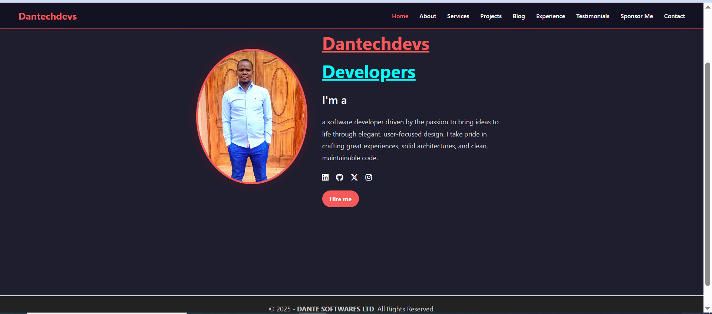

# 💼 Daniel's Developer Portfolio

This is my personal developer portfolio website, designed to showcase my skills, experience, and projects as a **Full-Stack Web Developer**.

🌐 **Live Preview:** Coming soon via GitHub Pages  
🎯 **Goal:** Present professional and freelance work, connect with clients, and provide a way to request new projects.

---

## 📂 Pages Included

- `index.php` / `index.html` – Home
- `about.php` – About Me
- `experience.php` – Skills & Work Experience
- `project.php` – Project Portfolio
- `services.php` – Services Offered
- `testimonial.php` – Client Testimonials
- `sponsor.php` – Collaborators / Sponsors
- `contact.php` – Contact Form
- `blog.php` / `single.php` – Blog Posts

---

## 🧰 Tech Stack

- **Frontend:** HTML5, CSS3, JavaScript
- **Styling:** Bootstrap 5, Custom CSS
- **Backend (Dynamic Pages):** PHP
- **Version Control:** Git & GitHub

---

## 🖼️ Screenshot



> 

---

## ⚙️ How to Run Locally

```bash
git clone https://github.com/Dantechdevs/Daniel-portfolio.git
cd Daniel-portfolio
# Use a local PHP server or XAMPP/Laragon to run .php files
```

You can open `index.html` directly in your browser or use `index.php` with a local server.

---

## 📬 Contact

- **Email:** damnngwasi@gmail.com  
- **GitHub:** [Dantechdevs](https://github.com/Dantechdevs)

---

## 📄 License

This portfolio project is open-source and available under the [MIT License](LICENSE).

---

> 🚀 Crafted with passion, clean code, and a user-friendly design to reflect both creativity and technical skill.